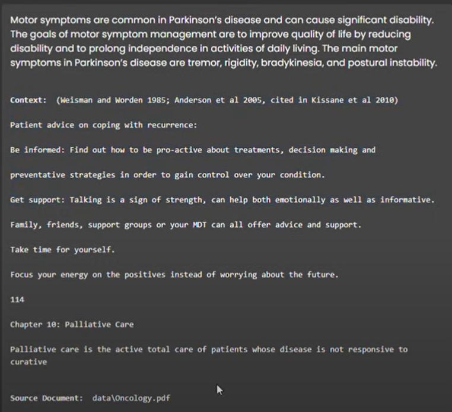
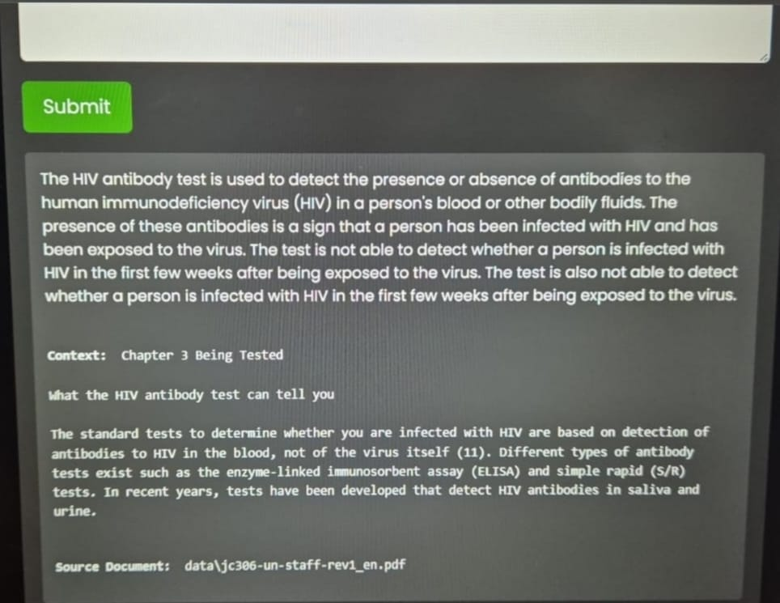

# BioMed-Retrieval (Medical RAG using Bio Mistral 7B)

Medical RAG using Bio Mistral 7B is a Retrieval-Augmented Generation (RAG) implementation built on a fully open-source stack. This project leverages **BioMistral-7B** for natural language processing, **PubMedBert** as an embedding model, **Qdrant** as a self-hosted vector database, and **LangChain** along with **Llama CPP** for orchestration. The solution is aimed at exploring new LLM use cases at the edge, particularly for medical applications.

---

## Overview

This repository demonstrates how to build a RAG system optimized for medical applications using a combination of state-of-the-art models and tools. The primary goal is to experiment with large language models (LLMs) at the edge rather than provide a production-ready medical chatbot.

> **Disclaimer:**  
> **This demo is intended for experimental purposes only. It is not recommended for production-grade medical chatbot deployments.**

---

## Features

- **LLM:** BioMistral-7B (INT4 version in GGUF format)
- **Embeddings:** PubMedBert for generating document embeddings
- **Vector Database:** Qdrant for efficient similarity search and vector storage
- **Orchestration:** LangChain & Llama CPP for pipeline management and inference

---

## System Requirements

### Hardware & Software

- **Processor:** Intel® Core™ Ultra 7 165H
- **Operating System:** Windows 11 Pro 23H2
- **RAM:** 64 GB
- **Python:** Version 3.11.9

### Additional Prerequisites

- [Microsoft Visual C++ Compiler Toolset](https://code.visualstudio.com/docs/cpp/config-msvc) (required for installing `llama-cpp-python`)

---

## Installation and Setup

Follow these steps to set up your development environment:

### 1. Clone the Repository

```bash
git clone https://github.com/sdivyanshu90/BioMed-Retrieval.git
cd Medical-RAG-using-Bio-Mistral-7B
```

### 2. Set Up a Python Virtual Environment

```bash
python -m venv biomistral_rag
# Activate the virtual environment:
# On Windows:
biomistral_rag\Scripts\activate
# On macOS/Linux:
source biomistral_rag/bin/activate

python -m pip install --upgrade pip
pip install -r requirements.txt
pip install qdrant-client --upgrade
```

### 3. Download the BioMistral-7B Model

Download the INT4 version of the model in GGUF format from:  
[BioMistral-7B Model](https://huggingface.co/MaziyarPanahi/BioMistral-7B-GGUF/blob/main/BioMistral-7B.Q4_K_M.gguf)

### 4. Download the Embedding Model

```bash
git lfs install
git clone https://huggingface.co/NeuML/pubmedbert-base-embeddings
```

### 5. Set Up Docker for Qdrant

- Install [Docker Desktop for Windows](https://docs.docker.com/desktop/setup/install/windows-install/).  
  _Tip: Configure proxy settings if needed._

### 6. Run the Qdrant Container

Pull and run the Qdrant container:

```bash
docker pull qdrant/qdrant
docker run -p 6333:6333 -v .\qdrant_db\:/qdrant/storage qdrant/qdrant
```

> **Access the Qdrant Dashboard:**  
> Open [http://localhost:6333/dashboard](http://localhost:6333/dashboard) in your browser.

### 7. Ingest Data to Create Embeddings

Generate embeddings for new documents located in the `data` folder:

```bash
python ingest.py
```

> **Note:** Verify the newly created collection via the Qdrant Dashboard.

### 8. Run the Application

Start the application using Uvicorn:

```bash
uvicorn app:app
```

---

## Sample Outputs

Below are some example outputs demonstrating the capabilities of the application:
Output 1:


Output 2:


---

## References and Additional Resources

- [BioMistral-7B Model on Hugging Face](https://huggingface.co/MaziyarPanahi/BioMistral-7B-GGUF)
- [PubMedBert Embeddings Repository](https://huggingface.co/NeuML/pubmedbert-base-embeddings)
- [Qdrant Documentation](https://qdrant.tech/documentation/)
- [LangChain Documentation](https://python.langchain.com/en/latest/)
- [Llama CPP Documentation](https://github.com/ggerganov/llama.cpp)

---

## Contributing

Feel free to open issues or submit pull requests if you have suggestions or improvements. For any questions or support, please reach out via the repository's issue tracker.
